# BloodHound Enterprise AlertBot

AlertBot is a Python CLI that turns BloodHound Enterprise Attack Path data into grouped webhook alerts.

Each run checks BHE once, sends any new alerts, and exits. You can schedule it with cron, a container scheduler, CI, or another automation runner. AlertBot keeps local JSON state so it can recognize data it has already alerted on.



## Prerequisites

- Python 3.9 or later.
- A BloodHound Enterprise API token with access to the endpoints listed in [BHE API access](#bhe-api-access).
- A webhook URL that accepts JSON `POST` requests.

Create a virtual environment and install AlertBot:

```sh
python3 -m venv .venv
source .venv/bin/activate
python3 -m pip install --upgrade pip
python3 -m pip install -e .
```

If you plan to run the tests, install the test extra:

```sh
python3 -m pip install -e ".[test]"
```

## Commands

Run the CLI:

```sh
alertbot --help
```

The CLI provides these commands:

- `alertbot setup`: interactively create `alertbot.config.json` and initialize `alertbot.state.json`.
- `alertbot run`: query BHE, group new Attack Paths, POST alerts, and update local state.
- `alertbot run --dry-run`: build alert payloads without posting webhooks or mutating state.
- `alertbot run --dry-run --output-json alerts.json`: write a local JSON preview for validation before sending to a webhook.

## Configuration

AlertBot reads `alertbot.config.json` by default.

Use environment variables for credentials when you can:

```sh
export BHE_ID="..."
export BHE_KEY="..."
```

If you enter a token ID and key during `alertbot setup`, AlertBot stores them in `alertbot.config.json`. That lets `alertbot run --dry-run` work without exported environment variables, but it also means the config file contains credentials. Keep it private.

Here is a minimal configuration:

```json
{
  "bhe": {
    "tenant": "example.bloodhoundenterprise.io",
    "scheme": "https",
    "port": 443,
    "token_id_env": "BHE_ID",
    "token_key_env": "BHE_KEY"
  },
  "domains": {
    "mode": "all",
    "selected_domains": []
  },
  "webhook": {
    "url": "https://webhook.example/alertbot",
    "timeout_seconds": 10.0,
    "provider": "auto"
  },
  "asset_group_tags": {
    "mode": "selected",
    "selected_tags": [
      {
        "id": 1,
        "name": "Tier Zero"
      }
    ]
  },
  "state_path": "alertbot.state.json",
  "first_run_behavior": "baseline",
  "dedupe_mode": "group",
  "page_size": 500,
  "log_level": "INFO"
}
```

AlertBot groups webhook payloads by the Attack Path types that BHE returns. `dedupe_mode` controls what it remembers:

- `group`: track each domain, asset group tag, and Attack Path type as alerted after the first successful delivery or baseline. This is the default.
- `finding`: track individual finding rows within each grouped Attack Path. The first payload for a group includes all unrecorded findings, and later payloads include only newly observed finding rows.

`webhook.provider` controls the delivery format:

- `auto`: use Slack formatting for Slack incoming webhook URLs and generic JSON for all other URLs. This is the default.
- `generic`: send the compact AlertBot JSON payload unchanged.
- `slack`: send a Slack incoming webhook message with top-level `text` and Block Kit `blocks`.

Slack incoming webhook URLs usually use `hooks.slack.com` or `hooks.slack-gov.com`. Treat the URL as a secret and keep it out of version control.

### Configuration reference

| Setting | Default | Purpose |
| --- | --- | --- |
| `bhe.tenant` | — | Required BHE tenant host, without a URL path. |
| `bhe.scheme` | `https` | URL scheme used for BHE API calls. |
| `bhe.port` | `443` | BHE API port. |
| `bhe.token_id_env` / `bhe.token_key_env` | `BHE_ID` / `BHE_KEY` | Names of environment variables containing BHE credentials. Environment values take precedence over the optional inline `bhe.token_id` and `bhe.token_key` values. |
| `domains.mode` | `all` | Monitor every available domain (`all`) or only IDs in `selected_domains` (`selected`). |
| `domains.selected_domains` | `[]` | Required domain IDs when `domains.mode` is `selected`. |
| `webhook.url` | — | Required destination URL for alert payloads. |
| `webhook.timeout_seconds` | `10.0` | Timeout, in seconds, for BHE and webhook HTTP requests. |
| `webhook.provider` | `auto` | `auto`, `generic`, or `slack`; `auto` selects Slack formatting for recognized Slack webhook URLs. |
| `asset_group_tags.mode` | `selected` | Monitor all returned tags (`all`) or only entries in `selected_tags` (`selected`). |
| `asset_group_tags.selected_tags` | — | Objects with an `id` and optional `name`; required when the mode is `selected`. Include ID `0` explicitly to monitor the default/hygiene tag. |
| `state_path` | `alertbot.state.json` | Persistent JSON file used for deduplication. Relative paths are resolved relative to the config file. |
| `first_run_behavior` | `baseline` | `baseline` records existing findings without alerting; `alert` delivers them on the first real run. |
| `dedupe_mode` | `group` | `group` alerts once per domain/tag/Attack Path type; `finding` alerts newly observed rows within those groups. |
| `page_size` | `500` | Number of BHE finding-detail rows requested per page; must be at least `1`. |
| `log_level` | `INFO` | Python log level for the process. |

If the config contains inline credentials, restrict access to it and the state file:

```sh
chmod 600 alertbot.config.json alertbot.state.json
```

## Setup

Run:

```sh
alertbot setup
```

Setup lists the available BHE domains and asset group tags. Enter `all` to monitor everything, or enter a comma-separated list such as `1,5,8` to select specific entries. It also asks what to do on the first real run:

- `baseline`: record all current Attack Paths without alerting.
- `alert`: send alerts for all current Attack Paths.

Setup also asks how to deduplicate alerts. Choose `group` to alert once per grouped Attack Path, or `finding` to alert when new finding rows appear in an existing group.

Setup and scheduled runs check `/api/version` first. They stop unless `product_edition` is `enterprise`.

Scheduled runs are non-interactive.

To monitor every asset group tag returned by `/api/v2/asset-group-tags`, use:

```json
{
  "asset_group_tags": {
    "mode": "all"
  }
}
```

`assetGroupTagId=0` is not included in `all` mode because it is not returned by `/api/v2/asset-group-tags`. Select it explicitly if you want the default/hygiene behavior.

## Scheduling

Each `alertbot run` checks BHE once and exits. Your scheduler decides how often that happens. Starting with a 15- to 60-minute interval usually makes sense.

For example, add this entry with `crontab -e` to run every 15 minutes. Use absolute paths for the executable, config, and log file:

```cron
*/15 * * * * /absolute/path/to/.venv/bin/alertbot --config /absolute/path/to/alertbot.config.json run >> /absolute/path/to/alertbot.log 2>&1
```

Cron does not load your interactive shell profile. Set `BHE_ID` and `BHE_KEY` in the scheduler's protected environment or in a small wrapper script. Do not put secrets directly in the crontab. The same applies to container schedulers and CI runners.

Keep the state file on persistent storage so every run uses the same file. Do not let runs overlap. Two runs can read the same state before either writes it, which can create duplicate alerts.

## BHE API access

The API token needs `GET` access to these BHE endpoints:

- `/api/version`
- `/api/v2/available-domains`
- `/api/v2/asset-group-tags`
- `/api/v2/domains/{domain_id}/available-types`
- `/api/v2/domains/{domain_id}/details`

AlertBot does not send alerts unless `/api/version` reports `product_edition` as `enterprise`.

## Running

Before enabling live alerts, run a dry run:

```sh
alertbot run --dry-run
```

To inspect the generated payloads in a local JSON file:

```sh
alertbot run --dry-run --output-json alerts.json
```

The output file includes the run summary and the exact payloads AlertBot would send. A dry run does not POST to the webhook or update local state.

To send alerts:

```sh
alertbot run
```

For each monitored domain and asset group tag, AlertBot groups findings by the available BHE Attack Path type. Each webhook POST contains one compact alert with counts and a small set of findings.

AlertBot updates its state only after the webhook accepts the alert. If delivery fails, the finding stays eligible for the next run.

### Exit status and failures

- `0`: the command completed with no failed webhook deliveries.
- `1`: configuration, state, credential, BHE API, or other validation error prevented the run.
- `2`: one or more webhook deliveries failed; those findings are not marked as alerted and will be retried on a later run.

Only HTTP `2xx` webhook responses count as successful delivery. Keep the scheduler's output in a monitored log or job record so you can investigate failures.

In `finding` deduplication mode, AlertBot prefers finding ID fields such as `id`, `ID`, `finding_id`, or `Finding ID` for state keys. If a row has no recognized ID field, AlertBot falls back to a stable hash of the row content.

If you switch an existing state file from `group` to `finding`, AlertBot treats the current findings in already recorded groups as a baseline. New finding rows after that baseline can still alert.

## Webhook payload

AlertBot sends JSON using `POST` and treats only `2xx` responses as success.

For `generic` webhooks, or non-Slack URLs when `provider` is `auto`, AlertBot sends this compact JSON shape.

Example payload:

```json
{
  "source": "bloodhound-enterprise-alertbot",
  "event_type": "new_attack_path",
  "domain": {
    "id": "S-1-5-21-example",
    "name": "example.local",
    "type": "active-directory"
  },
  "asset_group_tag": {
    "id": 1,
    "name": "Tier Zero"
  },
  "attack_path": {
    "id": "Attack Path Type",
    "type": "Attack Path Type",
    "name": "Attack Path Type",
    "severity": "high",
    "summary": "3 findings for Attack Path Type in example.local for Tier Zero from 2 source principals to 2 target principals.",
    "url": "https://example.bloodhoundenterprise.io/ui/graphview?environmentId=S-1-5-21-example&assetGroupTagId=1&findingName=Attack+Path+Type"
  },
  "counts": {
    "findings": 3,
    "source_principals": 2,
    "target_principals": 2,
    "objects": 0
  },
  "findings": [
    {
      "id": 1,
      "from": "alice@example.local",
      "to": "server01.example.local",
      "object": null,
      "title": "Attack Path Type",
      "severity": "high",
      "summary": "alice@example.local -> Attack Path Type -> server01.example.local"
    }
  ],
  "additional_findings": true,
  "observed_at": "2024-08-28T21:21:40.845Z",
  "alerted_at": "2026-06-17T12:05:00Z"
}
```

AlertBot builds `attack_path.url` from the BHE tenant, monitored domain ID, asset group tag ID, and Attack Path type in the configuration.

For Slack incoming webhooks, AlertBot converts the alert into a Slack message payload:

```json
{
  "text": "[HIGH] New BloodHound Attack Path: Attack Path Type in example.local",
  "blocks": [
    {
      "type": "header",
      "text": {
        "type": "plain_text",
        "text": "New Attack Path: Attack Path Type"
      }
    }
  ]
}
```

## Adding webhook providers

AlertBot separates BHE alert construction from destination formatting:

- `alertbot/alert_builder.py` builds the canonical AlertBot alert payload from grouped BHE data.
- `alertbot/providers/` contains destination-specific formatters.
- `alertbot/providers/__init__.py` registers providers and handles `auto` detection.
- `alertbot/webhook.py` handles the HTTP POST transport.

To add a destination, create a provider module with a unique `name`, `matches_url()`, and `build_payload()`. Then register it in `alertbot/providers/__init__.py`.

## Development checks

Run tests:

```sh
python3 -m pytest
```
